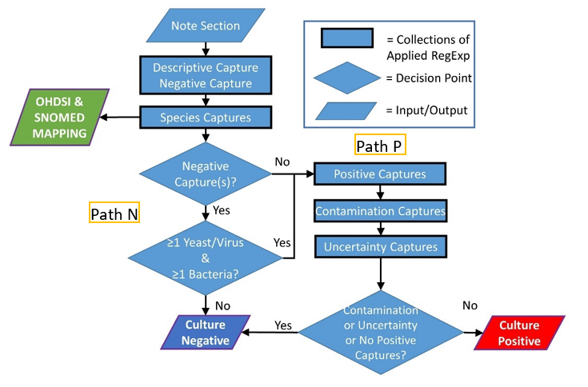

# MicrobEx Bacteria Culture Status Algorithm Rule Hierarchy:
## Overview:

* The general goal behind the algorithm rule hierarchy is to first sequentially separate negative bacteria culture status cases from unknown culture status cases, then to identify positive bacteria culture status cases from the unknown status cases, then to perform checks to minimize false positive and false negative classifications. The species present in the report are captured using species specific regular expressions, regardless of bacteria culture status, and are mapped to OMOP at the end. 

## Rationale:
* The first iteration of MicrobEx sequentially applied all regex blocks to all cases and an bacteria culture status classification was made based upon the ultimate regex block with a capture for the given note section. This algorithm was found to be sensitive but not specific in our testing on the derivation datasets. 
* We found that by first separating out all cases that had language patterns indicative of negative culture status first before searching for positive language patterns, we were able to greatly reduce the false positive rate, and therefore increase our classification specificity. This, however, came with a moderate increase in false negative classification rate.
* In our manual review, we found that many of these new false negative cases happened to have some negative language patterns present were being separated into the negative case list. Furthermore, these were found to most often involve cases with multiple organism types. <Decision point2> was added as a false negative correction, which allows cases with an initial negative classification to move to the potential positive group if at least one bacteria species and at least 1 yeast or virus species are present. Additionally, a similar correction was added for cases with a “negative for x, positive for y” type language pattern. 
* We further improved MicrobEx classification specificity by ending the positive regular expression path with a regex block dedicated to capturing language present in false positive cases. Captures in these regex collections cause the case to be flagged as “unclear” or “likely negative” and result in a negative culture status prediction, regardless of prior captures. 

## Detailed MicrobEx.annotate() algorithm logic: 
* The input of our algorithm is a whole or parsed section of a free-text microbiology culture reports. Within the algorithm, the note input is passed through a series of regular expression collections (regex blocks) that capture specific text elements associated with bacterial absence (negative), bacterial presence (positive), microbiological species, potential bacterial contamination, and uncertainty. The path a note takes through the algorithm is dictated by the captures that occur in the prior block(s). 

* Block1) Descriptive Capture:
    * Intended to capture information that is annotated on the corresponding case but doesn't affect bacterial positive classification. (E.G., non-descript quantitative information, specimen type, etc...)
* Block2) Negative Capture:
    * Intended to capture cases that are clearly negative for bacterial positive status. Expressions in this block are written with the intention of filtering out unintended captures, or text that is not corresponding to a negative bacterial status. 
        * For instance, ignoring “antibiotic susceptibility not detected”
* <Decision Point1: Negative Captures Y/N?>
    * Cases with and without a negative regex capture are sequestered from one another.
    * Cases with a negative capture proceed through path N
    * Cases with out a negative capture proceed through path P.
* Block3) Species Captures:

[Path N]:
* [N] the collection of species-specific regular expression lists are applied to all negative cases. these include lists for yeast, common virus, and bacteria (with a specific collection of lists for staph to accommodate coagulase negative vs positive).
    * <Decision Point2: Path P or continue with Path N?>
        * If a case is found to have: a negative capture, yeast and or virus capture, and >=1 bacteria capture, the case is sent to path P.
        * This is performed to help address false negatives of the form: "no yeast detected, staphylococcus detected".
        * All cases remaining in this negative capture group will have bacteria status classification = 0 (negative).

[Path P]:
* [P] Block4) Positive Capture block:
    * In this block, lists of increasingly specific regular expressions are applied to the case. (“positive unspecific block” (quantitative and qualitative language) -> “species specific block” )
        * The idea here is to start with expressions aimed at finding less specific positive language on the first pass (E.G “heavy growth present”) and capturing increasingly specific positive language with each subsequent regex block. 
        * The Path P regex block sequence is as follows: “positive unspecific” (quantitative and qualitative language) > “species specific” > “contamination” >  “uncertainty” (unclear captures and optional likely negative captures).

* [P] Block5&6) Contamination & Uncertainty blocks:
    * These sets of regular expressions designed to identify false positive prior captures, language suggesting culture contamination, and general unclear language. (e.g.: indeterminant; cannot be ruled out; culture in progress).
        * The likely_negative block is optional in the annotate() function since it was seen to trigger false negatives in some datasets. For validation sets 1 & 2 Likely_negative was not used.
        *  It’s goal is to look for certain words we found to be more likely associated with false positives, such as : "few bacteria seen".

# Regex_block & Regex Description:
Regex blocks holds numerous lists of regular expressions and dictionaries used throughout the Microbex.annotate() algorithm. These regular expression lists contain regular expressions designed for concept matching (often referred to as capture in this document). 
The regular expression lists are categorized by their desired capture theme (e.g. a unspecific positive: a bacteria positive culture that doesn't list a specific bacteria name.). the Microbex.annotate() algorithm runs each of these lists in a specific order and classifies bacterial positive status based on hierarichal logic described above. 

* All regular expression blocks used in MicrobEx are open-source and can viewed at: https://github.com/geickelb/microbex/blob/main/microbex/utils/regex_blocks.py
    * Regex contained within each regex block were written to only produce capture group(s) if the specified pattern (relating to the goal of the block it is contained within) is present.
    * Regex example (negative capture block):   r'(?<!resistance)(?<!susceptibility)\s+not\sdetected|indicated'
        * Goal: produce a capture group for “not detected” or “not indicated” if and only if not followed by either word “resistance” or “susceptibility”. 
        * Use case 1: https://regex101.com/r/vrdsVG/1
        * Use case 2: https://regex101.com/r/kGPzTs/1
* For detailing of the most utilized regular expressions used on validation sets 1 & 2, see the Run Report Summary in the supplemental materials of our manuscript (currently undergoing publication review.)

<!-- 

# Microbex.annotate() bacteria positive classification logic flow:

In general the logic uesd to classify bacteria positive status is as follows:
* a Microbex object is instantiated with a df with a microbiology note, culture_id, and visit_id per row
* a Microbex object is annotated using the .annotate() class method. see documentation for parameter info.
* descriptive regex lists capture information that is annotated on the corresponding case, but doesn't affect bacterial positive classification. (eg non-descript quantitative information, specimen type, etc...)
* Next, regular expressions in the negative_regex_list are applied in order to capture cases that are clearly negative for bacterial positive status. 
    * e.g. "no infection detected"
* Next, cases with and without a negative regex capture are sequestered from one another.
* for cases with a negative capture, the collection of species_specific regular expression lists are applied to all negative cases. these include lists for yeast, common virus, and bacteria (with a specific collection of lists for staph to accomodate coagulase negative vs positive). 
    * if a case is found to have: a negative capture, yeast and or virus capture, and >=1 bacteria capture, the case is joined to the cases without any negative capture.
    * this is performed to help address false negatives of the form: "no yeast detected, staphylococcus detected".
    * all cases remaining in this negative capture group will have bacteria status classification = 0 (negative). 
* for cases without negative captures, they are passed into the "positive capture block". In this block, lists of increasingly specific regular expressions are applied to the case. 
    * First, unspecific_positive, then quantitative_positive, then species_specific positive, then staphylococcus specific positive (seperates coagulase negative vs positive), and finally some correction adjustment lists: unclear_positive and likely_negative. 
    * The goal of this is to have the latest capture be the most specific relating to positive. Once the most specific positives are captured, the correction lists look for language that might have triggered false positives, or might not have been captured yet. (e.g: indeterminent; cannot be ruled out; culture in progress).
        * the likely_negative list has an option in the run() function to be included as it can sometimes trigger false negatives. these look for certain words we found to be more likely associated with false positives, such as : "few bacteria seen". 
* finally, all positive block cases with either an unclear, likely_negative capture, or no capture at all are classified as bacteria status 0(negative)
* all other cases with a positive regex capture are classified as bacteria status= 1 (positive ) -->

# Microbex.annotate() output column descriptions:

In the MicrobEx output dataframe, each of the regular expressions captured by their associated lists or blocks are annotated in a specified column for easier auditing. A column title with "capt" in it will present the text captured by the regular expression, while a column title with "regex" will present the raw regular expression used to capture the capt text. The associated columns are as follows in the format {block_name: [column names]}

unspecific_positives: [pos_qual_capt,pos_qual_regex, pos_quant_capt,pos_quant_regex]

descriptives:[quant_descriptive_capt,quant_descriptive_regex, specimen_descriptive_capt, specimen_descriptive_regex]

virus and yeast species capture: [virus_capt, virus_regex, yeast_capt,yeast_regex]

bacteria species specific captures (on both positive and negative cases): [species_capt,species_regex]
    * note: cases with negative capture still have species extract performed, a species present here does not necessarily indicate bacteria status = positive.

ALL species collection (concat of bacteria + virus + yeast): [species_capt_all]

unclear and likely-negative false positive correction blocks: [unclear_capt, unclear_regex, likelyneg_capt,likelyneg_regex]

virus and yeast species capture: [virus_capt, virus_regex, yeast_capt,yeast_regex]

the following columns contain the corresponding capture used to make the bacteria positive classification. this is purely for debugging, as this information is available in other capture columns:
[regex_capture,regex_capture_quant,regex_capture_specimen,regex_source, regex_text, pos_culture_status, pos_culture_audit1,pos_culture_audit2]

columns used for regex block -> classification accounting: [pos_culture_audit1,pos_culture_audit2]
* pos_culture_status= final bacteria positive status classification. 
* pos_culture_audit1, pos_culture_audit2 start with the granular detail of which regex blocks were used to make classification. pos_culture_audit1 shows the regex index used to make a classification, which pos_culture_audit2 shows broad regex block categories. pos_culture_audit2 is directly mapped to result_num via dictionary. 

OHDSI concept mapping (can be used to map to SNOMED): [OHDSI_ID, OHDSI_Concept]

flora_flag: depreciated, will be removed in future versions. 

# Audit and adding custom regular expressions guide:
see audit_examples.ipynb in MicrobEx root folder. 